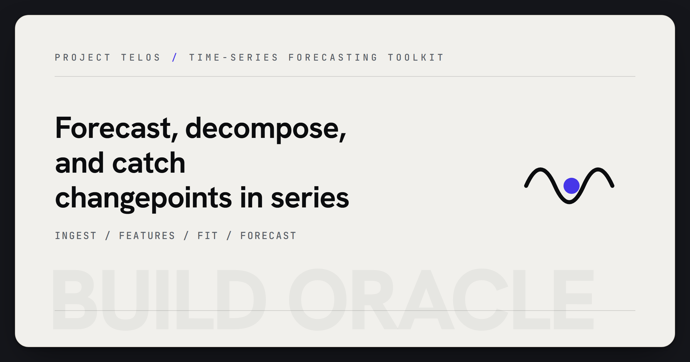

<p align="center">
  
</p>

# Build Oracle

Time series forecasting and anomaly detection toolkit.

## Features

- **ARIMA** — Auto-regressive integrated moving average with automatic order selection
- **Prophet-style** — Exponential smoothing with trend, seasonality, and holiday decomposition
- **Neural Networks** — Feedforward and recurrent architectures for non-linear forecasting
- **Changepoint Detection** — BIC/AIC penalty-based structural break identification
- **Decomposition** — Seasonal-trend decomposition (STL-style) with configurable period
- **Feature Engineering** — Lag features, rolling statistics, Fourier terms

## Installation

```bash
# Core (numpy + scipy only)
pip install .

# With all optional dependencies
pip install ".[all]"
```

## Quick Start

### CLI

```bash
# Forecast with ARIMA (built-in sample data)
build-oracle forecast --data sample --model arima --horizon 30

# Decompose a time series
build-oracle decompose --data sample --period 7

# Detect changepoints
build-oracle changepoints --data sample --penalty bic

# Extract features
build-oracle features --data sample

# Launch GUI
build-oracle gui
```

### Python API

```python
from build_oracle.arima import ARIMAModel

model = ARIMAModel(order=(2, 1, 1))
model.fit(training_data)
forecast = model.predict(horizon=30)
```

## Supported Models

| Model | Use Case |
|---|---|
| ARIMA | Stationary/near-stationary univariate series |
| Prophet-style | Series with strong seasonality and holidays |
| Neural Net | Complex non-linear patterns |
| Changepoint | Detecting regime shifts in data |

## Requirements

- Python >= 3.10
- numpy >= 1.24
- scipy >= 1.10
- Optional: pandas, scikit-learn, matplotlib, PyQt6

## License

Proprietary
